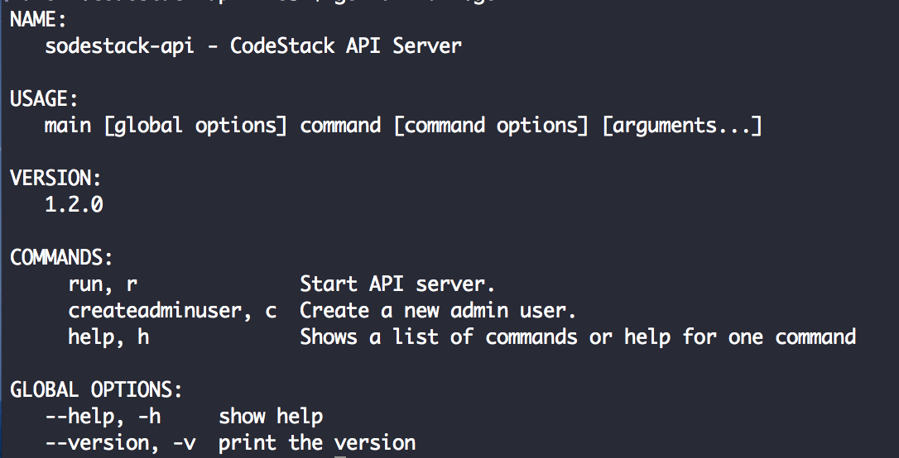

# Codestack-Api

<!-- v1.1.0 -->

REST-ful API written in Go (goland) for [CodeStack](https://github.com/WhoSV/codestack) Application

## Getting started

**Get dependencies**

`$ cd codestack-api/`

`$ go get`

**Run**

`go run main.go`

**Browse**

`http://localhost:8000`

## Frontend for this Application

[CodeStack](https://github.com/WhoSV/codestack)
